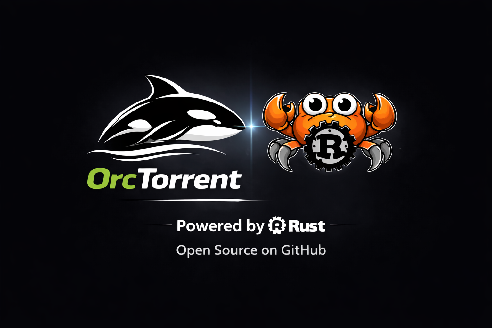
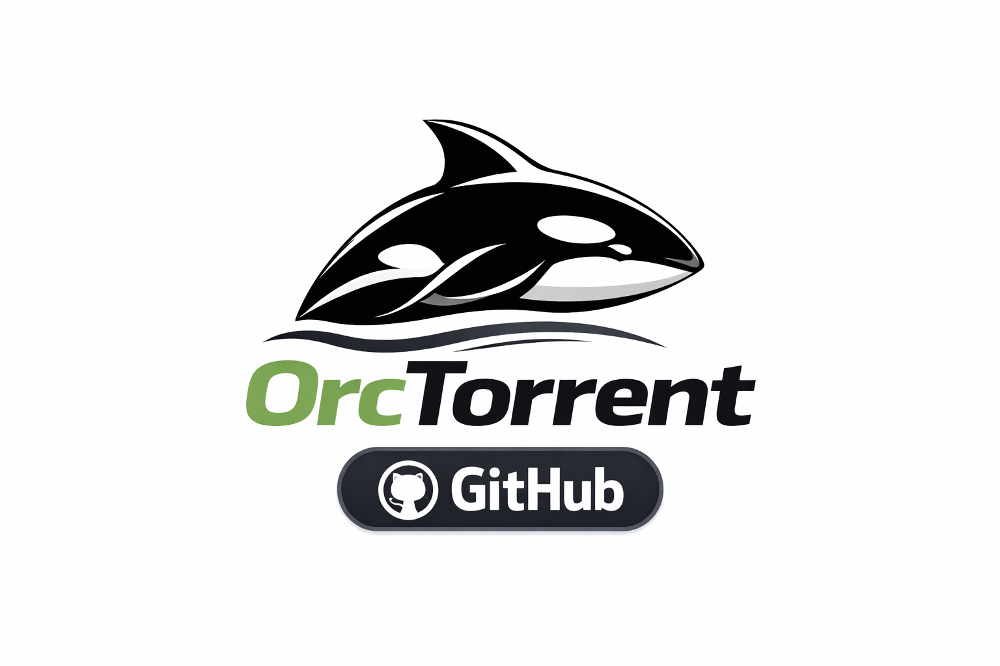

# ORC Torrent



**Repository:** [github.com/The-animus-project/Orc-Torrent](https://github.com/The-animus-project/Orc-Torrent)

ORC Torrent is a decentralized BitTorrent client built with privacy in mind. We use a Rust backend for the engine and API, and an Electron + React desktop app for the interface—so you get a secure, maintainable client that we can keep improving over time.

**ORC Torrent is compatible with Windows, macOS, and Linux.** You can build and run it on any of these platforms.

**ORC Torrent is actively developed.** We update the roadmap and documentation as we go. If you’re interested in where we’re headed or how to contribute, read on.

---

## Table of contents

- [Screenshots](#screenshots)
- [Features](#features)
- [What makes it different](#what-makes-it-different)
- [Roadmap](#roadmap)
- [Architecture](#architecture)
- [Requirements](#requirements)
- [Building from source](#building-from-source) — see [Install-Instructions](Install-Instructions/) for OS-specific guides
- [Configuration](#configuration)
- [Usage](#usage)
- [Development](#development)
- [Changelog](#changelog)
- [Authors and contributors](#authors-and-contributors)
- [License](#license)

---

## Screenshots

Screenshots of the ORC Torrent desktop client:

| | |
|:---:|:---:|
| **Loading animation** | **Main interface** |
|  |  |
| **Client view** | **Client view** |
|  |  |

---

## Features

| Area | Description |
|------|-------------|
| **Torrent management** | Add via magnet links or `.torrent` files; list, start, stop, remove, recheck, and announce torrents. |
| **File control** | Per-file priority and content view; resume from existing downloads. |
| **Peers and trackers** | Inspect connected peers and tracker status. |
| **VPN and kill switch** | VPN interface detection (e.g. tun/wg); optional kill switch to pause all torrents when the VPN disconnects. |
| **Network posture** | Policy, bind interface, and threat presets. |
| **Security** | Request validation, error sanitization, optional admin token for remote or network use. |
| **Desktop integration** | Magnet and `.torrent` file associations; **custom notification sounds** (multiple built-in sounds for download-complete and kill-switch; choose in settings or use your own). |

---

## What makes it different

Beyond standard BitTorrent behaviour, we’ve added:

| Feature | Description |
|---------|-------------|
| **VPN-aware kill switch** | Detects VPN interfaces (tun/wg and common provider names) and can pause all torrents when the VPN drops so traffic doesn’t leak to the clearnet. |
| **GeoIP integration** | Peer and tracker data can be enriched with country info (GeoLite2) for visibility and policy. |
| **Network posture and policy** | Central policy for when network is allowed, bind-interface control, and threat presets so behaviour fits your setup. |
| **Hardened daemon API** | Request validation, torrent ID checks, body size and concurrency limits, sanitized errors, constant-time admin token check, and security headers. |
| **Daemon and desktop split** | The Rust daemon runs the BitTorrent session and REST API; the Electron app manages the daemon and provides the UI. That separation keeps the engine stable and lets us update pieces independently. |
| **Torrent profiles** | Per-torrent mode and hop settings, with an eye toward future ecosystem and onion-style workflows. |
| **Custom notification sounds** | Multiple built-in sounds for download-complete and kill-switch events; pick one in settings or supply your own file. Enable/disable per event in the desktop app. |

---

## Roadmap

We keep a roadmap here and update it as we progress. A more detailed, living roadmap may be added as the project grows.

| Phase | Description |
|-------|-------------|
| **Stabilization** (current) | We’re focusing on reliability, performance, and polish: edge cases, error handling, and a solid experience on Windows, macOS, and Linux. |
| **Ecosystem** (next) | After stabilization we’ll move on to ecosystem-oriented features, integrations, and patches—tooling, protocols, and community-driven improvements. |
| **Security** (planned) | **Major security updates are planned:** hardening of the daemon API, auth, and network posture; we’ll detail these in the roadmap as we lock them in. |

If you want to help shape the roadmap or contribute, open an issue or get in touch.

---

## Architecture

ORC Torrent is split into a backend daemon and a desktop frontend:

| Component | Location | Role |
|-----------|----------|------|
| **Desktop app** | `ui/desktop/` | Electron main process manages daemon lifecycle (start, health checks, restarts); React renderer talks to the daemon over HTTP. |
| **Daemon** | `crates/orc-daemon/` | Axum REST API (default: `127.0.0.1:8733`). Handles routing, validation, CORS, and security headers. |
| **Core** | `crates/orc-core/` | Shared state (torrents, policy, kill switch), GeoIP, VPN detection, and all logic that uses the BitTorrent engine. |
| **BitTorrent engine** | `crates/librqbit-patched/` | Patched [rqbit](https://github.com/nicksrandall/rqbit) 8.1.1 for peer stats and full API support. |

A more detailed technical overview is in [docs/CODEBASE_OVERVIEW.md](docs/CODEBASE_OVERVIEW.md).

---

## Requirements

- **Rust** (stable) — to build the daemon
- **Node.js** 20+ and **npm** — to build and run the desktop UI
- **Platforms**: ORC Torrent runs on **Windows**, **macOS**, and **Linux**. See [Install-Instructions](Install-Instructions/) for step-by-step compiling guides per OS.

---

## Building from source

For detailed, OS-specific steps (prerequisites, build order, packaging), see **[Install-Instructions](Install-Instructions/)** (Windows, macOS, Linux).

Quick overview:

### 1. Build the daemon

From the **repository root**:

```bash
cd crates
cargo build --release -p orc-daemon
```

The binary is produced at `crates/target/release/orc-daemon` (or `orc-daemon.exe` on Windows).

### 2. Install the daemon for the desktop app

Copy the built binary into the desktop app’s asset directory:

- **Windows**: `copy crates\target\release\orc-daemon.exe ui\desktop\assets\bin\`
- **Linux / macOS**: `cp crates/target/release/orc-daemon ui/desktop/assets/bin/`

### 3. Build and package the desktop app

```bash
cd ui/desktop
npm install
npm run build
npm run dist
```

- `npm run build` — builds the daemon (if the script invokes it), Vite renderer, and TypeScript for main and preload.
- `npm run dist` — full Electron build (e.g. Windows NSIS installer and zip; Linux/macOS if configured).

To run in development without packaging:

```bash
cd ui/desktop
npm run dev
```

---

## Configuration

### Daemon

| Item | Environment variable | Description |
|------|----------------------|-------------|
| Bind address | `DAEMON_BIND` | Default: `127.0.0.1:8733`. Non-loopback binding requires `DAEMON_ADMIN_TOKEN`. |
| Admin token | `DAEMON_ADMIN_TOKEN` | Optional; required when exposing the API beyond localhost. Use a strong value (e.g. 32+ characters). |
| Download directory | `ORC_DOWNLOAD_DIR` | Default: the user’s **Downloads** folder on Windows, macOS, and Linux. |

**Config file** (e.g. listen port):

- **Windows**: `%APPDATA%\OrcTorrent\config.json`
- **macOS**: `~/Library/Application Support/OrcTorrent/config.json`
- **Linux**: `~/.config/OrcTorrent/config.json`

### Desktop

The desktop UI reads and writes settings (including notifications and security) through the daemon API; the daemon configuration above applies.

---

## Usage

1. Install using the Windows installer (or run the portable build) and start **ORC TORRENT**.
2. The app starts the daemon automatically and waits until it’s healthy before showing the UI.
3. Add torrents via drag-and-drop, file picker, or associated magnet links.
4. Use the torrent list and inspector for overview, files, peers, trackers, and transfers.
5. Configure VPN, kill switch, and network posture in the app’s network and settings areas.

---

## Development

We welcome contributions. The codebase is organized so the daemon and desktop can be worked on independently.

- **Rust**: From `crates/`, run `cargo build --release -p orc-daemon`; run tests with `cargo test`.
- **Desktop**: From `ui/desktop/`, run `npm run dev` for development; `npm run build` then `npm run dist` for a full package.
- **CI**: The workflow in [.github/workflows/build-release.yml](.github/workflows/build-release.yml) runs on `workflow_dispatch` or tags `v*`, builds the Windows installer and zip, and can create a GitHub Release with those artifacts.

If you’re not sure where to start, check the [roadmap](#roadmap) and open issues—we’re happy to point you to a good first task.

---

## Changelog

We keep a changelog of notable changes. **Last 5 updates:**

| Version | Highlights |
|---------|-------------|
| **2.2.14** | Install instructions for Windows, macOS, and Linux; cross-platform compatibility in docs. |
| **2.2.13** | License switched to AGPL-3.0; full LICENSE file and project copyright. |
| **2.2.12** | Custom notification sounds (multiple built-in sounds, settings UI); roadmap in README. |
| **2.2.11** | Daemon security: request validation, limits, sanitized errors, constant-time admin token, security headers. |
| **2.2.10** | Multi-platform support (Windows/Linux/macOS); authors and contributors in README. |

Full history: **[CHANGELOG.md](CHANGELOG.md)**.

---

## Authors and contributors

ORC Torrent is developed and maintained by **ORC Torrent** and **the ANIMUS PROJECT** (Vurzum, BuGmaN).

- **GitHub:** [Animus-exe](https://github.com/Animus-exe)
- **Twitter:** [@vurzumm](https://x.com/vurzumm)

```
  /\_/\  (
 ( ^.^ ) _)
   \"/  (
 ( | | )
(__d b__)
```

---

## License

This project is licensed under the **GNU Affero General Public License v3.0 (AGPL-3.0)**.  
Copyright (C) 2026 ORC Torrent and The ANIMUS PROJECT.  
See the [LICENSE](LICENSE) file for the full text, or <https://www.gnu.org/licenses/agpl-3.0.html>.

---


