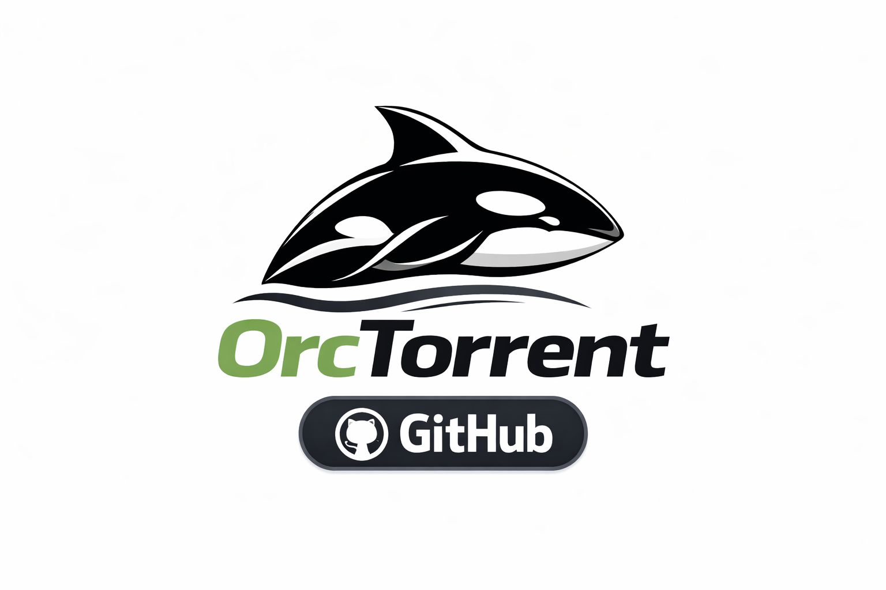

# ORC Torrent


**Repository:** [github.com/The-animus-project/Orc-Torrent](https://github.com/The-animus-project/Orc-Torrent)

**Official website:** [Orclabs.io](https://orclabs.io)

ORC Torrent is a decentralized BitTorrent client built with privacy in mind. A shared Rust engine powers the Electron desktop app and the native Android shell, with React providing adaptive desktop and phone interfaces.

**ORC Torrent is compatible with Android 10+, Windows, macOS, and Linux.**

**Latest release: [v2.4.0](https://github.com/The-animus-project/Orc-Torrent/releases/tag/v2.4.0)** — the first Android release, with on-device torrenting, shared-folder storage, background transfers, Wi-Fi-first networking, and VPN-aware protection.

**Android is here.** Phones and tablets running Android 10+ can install ORC from the signed `arm64-v8a` APK. See the [Android installation guide](Install-Instructions/Android.md) for download, verification, sideloading, and first-run setup.

<p align="center">
  <a href="https://github.com/The-animus-project/Orc-Torrent/releases/latest/download/ORC-TORRENT-Setup-2.4.0.exe">
    
  </a>
  &nbsp;
  <a href="https://github.com/The-animus-project/Orc-Torrent/releases/latest/download/ORC-TORRENT-2.4.0-mac-arm64.dmg">
    
  </a>
  &nbsp;
  <a href="https://github.com/The-animus-project/Orc-Torrent/releases/latest/download/ORC-TORRENT-2.4.0-linux-x86_64.AppImage">
    
  </a>
</p>
<p align="center">
  <a href="https://github.com/The-animus-project/Orc-Torrent/releases/latest/download/ORC-TORRENT-2.4.0-android-arm64-v8a.apk">
    
  </a>
</p>
<p align="center">
  <sub>Windows installer · macOS DMG (Apple Silicon and Intel) · Linux AppImage · Android APK — <a href="https://github.com/The-animus-project/Orc-Torrent/releases/latest">portable zips &amp; other formats</a></sub>
</p>
<p align="center">
  <a href="https://github.com/The-animus-project/Orc-Torrent">
    
  </a>
</p>

**ORC Torrent is actively developed.** We update the roadmap and documentation as we go. If you’re interested in where we’re headed or how to contribute, read on.

---

## Downloads

Pre-built installers and portable archives are published on **[GitHub Releases](https://github.com/The-animus-project/Orc-Torrent/releases)**. CI builds run on every `v*` tag.

| Platform | Portable (no install) | Installer |
|----------|----------------------|-----------|
| **Windows** (x64) | `ORC-TORRENT-<version>-win-x64.zip` | `ORC-TORRENT-Setup-<version>.exe` |
| **macOS** (arm64 / x64) | `ORC-TORRENT-<version>-mac-<arch>.zip` | `.dmg`, `.pkg` |
| **Linux** (x64) | `ORC-TORRENT-<version>-linux-x86_64.AppImage` | `.deb` |
| **Android** (arm64, Android 10+) | `ORC-TORRENT-<version>-android-arm64-v8a.apk` | Sideload the signed APK |

**Portable** builds run without an installer — extract or make executable, then launch the app. **Installers** register shortcuts, menu entries, and (on Windows/macOS) magnet / `.torrent` file associations.

### Verify a release build with PGP

Signed release builds are published with armored detached PGP signatures. Download the build and its matching `.asc` file from the same [GitHub release](https://github.com/The-animus-project/Orc-Torrent/releases), then download [`ORC-Torrent-Release-Key.asc`](ORC-Torrent-Release-Key.asc) from this repository.

Import the release key and confirm its fingerprint:

```sh
gpg --import ORC-Torrent-Release-Key.asc
gpg --fingerprint 6D0D5CE9E0DA5A92
```

The fingerprint must be:

```text
094F 3796 D3B6 99DB 5E69 A278 6D0D 5CE9 E0DA 5A92
```

Verify the downloaded build before opening or extracting it. For example:

```sh
gpg --verify ORC-TORRENT-2.4.0-linux-x86_64.AppImage.asc ORC-TORRENT-2.4.0-linux-x86_64.AppImage
```

You can also verify the signed checksum manifest and then check all downloaded builds in it:

```sh
gpg --verify SHA256SUMS.asc SHA256SUMS
shasum -a 256 -c SHA256SUMS
```

A valid result reports a good signature made by the key above. A good signature proves the file has not changed since it was signed; independently confirm the fingerprint from a trusted source before trusting the key. PGP signing is separate from Windows Authenticode and Apple Developer ID signing, so the operating system may still display an unverified-developer warning.

---

## Installation

Download the asset for your OS from the [latest release](https://github.com/The-animus-project/Orc-Torrent/releases/latest). Replace `<version>` below with the release tag (e.g. `2.4.0`).

### Windows

| Method | Steps |
|--------|--------|
| **Portable** | Download `ORC-TORRENT-<version>-win-x64.zip` → extract to any folder → run **`ORC TORRENT.exe`**. No admin rights required; safe to keep on a USB drive. |
| **Installer** | Download `ORC-TORRENT-Setup-<version>.exe` → run the wizard → start **ORC TORRENT** from the Start menu or desktop shortcut. |

On first launch, Windows SmartScreen may warn because the build is unsigned — choose **More info** → **Run anyway**. Portable and installer builds both support in-app updates (Settings → Updates).

### macOS (Apple Silicon or Intel)

| Method | Steps |
|--------|--------|
| **Portable** | Download `ORC-TORRENT-<version>-mac-arm64.zip` on Apple Silicon or `ORC-TORRENT-<version>-mac-x64.zip` on Intel → extract → open **`ORC TORRENT.app`**. |
| **DMG** | Open the `.dmg` → drag **ORC TORRENT** to **Applications**. |
| **PKG** | Run the `.pkg` installer → follow the prompts. |

macOS may block the app on first open (unverified developer). Use **right-click → Open**, or allow it under **System Settings → Privacy & Security**. Choose **arm64** for Apple Silicon or **x64** for Intel Macs.

### Linux (x64)

| Method | Steps |
|--------|--------|
| **Portable (AppImage)** | Download `ORC-TORRENT-<version>-linux-x86_64.AppImage` → `chmod +x ORC-TORRENT-*-linux-x86_64.AppImage` → run it. No root or package manager required. |
| **.deb** | `sudo dpkg -i ORC-TORRENT-<version>-linux-amd64.deb` → launch from your application menu. |

AppImages need [FUSE](https://github.com/AppImage/AppImageKit/wiki/FUSE) on some distributions (`libfuse2` on Ubuntu/Debian).

### Android 10+

Download `ORC-TORRENT-<version>-android-arm64-v8a.apk` from GitHub Releases, verify the signed checksum manifest, and allow your browser or file manager to install that APK. On first launch, create or select a dedicated ORC subfolder with Android's system folder picker. The app does not request broad storage access, and completed files remain in that shared folder after uninstall.

Transfers use unmetered Wi-Fi by default. Cellular data and the VPN kill switch are explicit opt-ins in Settings and Privacy.

For complete download-verification, sideloading, onboarding, updating, and troubleshooting steps, read **[Install ORC Torrent on Android](Install-Instructions/Android.md)**.

### After install

1. Start **ORC TORRENT**. Desktop launches its local daemon automatically; Android starts the same Rust engine on-device.
2. Add torrents via drag-and-drop or file picker on desktop, or the Add sheet and Android Open With/Share flows on mobile. Both platforms accept magnet links and `.torrent` files.
3. Desktop can use **Settings → Updates**. Android updates are installed by downloading the next signed APK from GitHub Releases and installing it over the existing app.

To compile from source instead of using a release build, see [Building from source](#building-from-source) and [Install-Instructions](Install-Instructions/).

---

## Table of contents

- [Downloads](#downloads)
- [Verify a release build with PGP](#verify-a-release-build-with-pgp)
- [Installation](#installation)
- [Screenshots](#screenshots)
- [Features](#features)
- [What makes it different](#what-makes-it-different)
- [Speed comparison](#speed-comparison)
- [Roadmap](#roadmap)
- [Architecture](#architecture)
- [Requirements](#requirements)
- [Building from source](#building-from-source) — see [Install-Instructions](Install-Instructions/) for OS-specific guides
- [Configuration](#configuration)
- [Usage](#usage)
- [Development](#development)
- [Changelog](#changelog)
- [Author](#author)
- [License](#license)

---

## Screenshots

Screenshots of the ORC Torrent desktop client:

| | |
|:---:|:---:|
| **Loading animation** | **Main interface** |
|  |  |
| **Client view** | **Client view** |
|  |  |

---

## Features

| Area | Description |
|------|-------------|
| **Torrent management** | Add via magnet links or `.torrent` files; list, start, stop, remove, recheck, and announce torrents. |
| **File control** | Per-file priority and content view; resume from existing downloads. |
| **Peers and trackers** | Inspect connected peers and tracker status. |
| **Torrent search** | Search page for user-configured RSS/Atom/JSON feeds and **Torznab** providers (Jackett / Prowlarr compatible). ORC ships without search providers, and results are display-only until you manually add a torrent. |
| **Watch folders** | Auto-import `.torrent` files dropped into configured folders (debounced, duplicate-safe). |
| **Seeding controls** | Global ratio and seed-time limits; completed torrents stop automatically when targets are met. |
| **Bandwidth scheduling** | Normal and limited speed profiles with quiet-hours schedule. |
| **Privacy dashboard** | Consolidated VPN/kill-switch risk card with one-click VPN Safety Mode. |
| **Network page** | Adapter list, default route, DNS, VPN signal, and kill-switch enforcement status. |
| **GitHub auto-update** | Check for updates, download in the background, and restart to install from Settings → Updates. |
| **VPN and kill switch** | VPN interface detection (e.g. tun/wg); optional kill switch to pause all torrents when the VPN disconnects. |
| **Network posture** | Policy, bind interface, and threat presets. |
| **Security** | Request validation, error sanitization, optional admin token for remote or network use. |
| **Desktop integration** | Magnet and `.torrent` file associations; **custom notification sounds** (multiple built-in sounds for download-complete and kill-switch; choose in settings or use your own). |

---

## What makes it different

Beyond standard BitTorrent behaviour, we’ve added:

| Feature | Description |
|---------|-------------|
| **VPN-aware kill switch** | Detects VPN interfaces (tun/wg and common provider names) and can pause all torrents when the VPN drops to reduce accidental clearnet exposure. |
| **GeoIP integration** | Peer and tracker data can be enriched with country info (GeoLite2) for visibility and policy. |
| **Network posture and policy** | Central policy for when network is allowed, bind-interface control, and threat presets so behaviour fits your setup. |
| **Hardened daemon API** | Request validation, torrent ID checks, body size and concurrency limits, sanitized errors, constant-time admin token check, and security headers. |
| **Daemon and desktop split** | The Rust daemon runs the BitTorrent session and REST API; the Electron app manages the daemon and provides the UI. That separation keeps the engine stable and lets us update pieces independently. |
| **Socket-level bind interface** | When a bind interface is set, the engine binds TCP, DHT, and tracker traffic to that address; posture changes hot-rebind without a daemon restart. |
| **Policy persistence** | Kill switch, net posture, seeding, bandwidth, and watch-folder settings survive daemon restarts via `config.json`. |
| **Custom notification sounds** | Multiple built-in sounds for download-complete and kill-switch events; pick one in settings or supply your own file. Enable/disable per event in the desktop app. |

---

## Speed comparison

We compared ORC Torrent with qBittorrent, Transmission, and Deluge using the same official Ubuntu torrent on the same Apple Silicon Mac. The controlled suite used an exact 512 MiB target, three runs per client, randomized execution order, fresh client state, unlimited rates, and matching 128-peer limits.

| Client | Controlled result | Median time to 512 MiB | Median target average | ORC throughput advantage |
|---|---:|---:|---:|---:|
| **ORC Torrent 2.3.3** | **3/3 completed** | **14.943 s** | **35.929 MB/s** | — |
| qBittorrent 5.2.3 | 3/3 completed | 41.685 s | 12.879 MB/s | **2.790×** |
| Transmission 4.1.3 | 3/3 completed | 268.130 s | 2.002 MB/s | **17.944×** |
| Deluge 2.2.0 | 0/3 before cutoff | >600 s each | 0.0205 MB/s partial-window median | **>40.154× lower bound** |

ORC used **64.15% less time than qBittorrent** and **94.43% less time than Transmission** to reach 512 MiB. It achieved this with a median peak of 46 observed peer rows, versus 127 for qBittorrent, suggesting that productive-peer use and request scheduling mattered more than raw connection count in this test window.

These August 2, 2026 results describe this benchmark window, not guaranteed performance for every torrent or network. Deluge ran in an ARM64 Linux container because its current native macOS setup was incompatible. See the [full multi-client benchmark](docs/benchmarks/torrent-client-comparison-2026-08-02.md) for every run, the earlier full-payload comparison, methodology, environment, machine-readable data, and limitations.

---

## Roadmap

We keep a roadmap here and update it as we progress. A more detailed, living roadmap may be added as the project grows.

| Phase | Description |
|-------|-------------|
| **Stabilization** (current) | Cross-platform polish, CI releases, tests, docs honesty, and reliability fixes after the v2.3.0 feature push. |
| **Daily driver** (in progress) | Watch folders, privacy dashboard, VPN Safety Mode, seeding/bandwidth automation, and auto-update — shipped in **2.3.0**; ongoing hardening and UX refinement. |
| **Ecosystem** (future) | Integrations and community-driven improvements; generic search provider interface only (no piracy indexers). |

Documentation: [Install](docs/INSTALL.md) · [Development](docs/DEVELOPMENT.md) · [Codebase overview](docs/CODEBASE_OVERVIEW.md) · [Privacy/VPN](docs/PRIVACY_VPN.md) · [Known limitations](docs/KNOWN_LIMITATIONS.md) · [Configuration](docs/CONFIGURATION.md) · [Testing checklist](docs/TESTING_CHECKLIST.md)

---

## Architecture

ORC Torrent is split into a backend daemon and a desktop frontend:

| Component | Location | Role |
|-----------|----------|------|
| **Desktop app** | `ui/desktop/` | Electron main process manages daemon lifecycle (start, health checks, restarts); React renderer talks to the daemon over HTTP. |
| **Daemon** | `crates/orc-daemon/` | Axum REST API (default: `127.0.0.1:8733`). Handles routing, validation, permissive CORS on loopback only, and security headers. |
| **Core** | `crates/orc-core/` | Shared state (torrents, policy, kill switch), GeoIP, VPN detection, and all logic that uses the BitTorrent engine. |
| **BitTorrent engine** | `crates/librqbit-patched/` | Patched [rqbit](https://github.com/ikatson/rqbit) 8.1.1 by Igor Katson (Apache-2.0), with peer stats and full API support. |

A more detailed technical overview is in [docs/CODEBASE_OVERVIEW.md](docs/CODEBASE_OVERVIEW.md).

---

## Requirements

- **Rust** (stable) — to build the daemon
- **Node.js** 20+ and **npm** — to build and run the desktop UI
- **Platforms**: ORC Torrent runs on **Windows**, **macOS**, and **Linux**. See [Install-Instructions](Install-Instructions/) for step-by-step compiling guides per OS.

---

## Building from source

For detailed, OS-specific steps (prerequisites, build order, packaging), see **[Install-Instructions](Install-Instructions/)** (Windows, macOS, Linux).

### Windows: one command from the repo root

From the **repository root**, after Rust and Node are installed:

- **`build.cmd`** — compile daemon + UI (no installer).
- **`build.cmd -Dist`** — same, then run electron-builder (NSIS installer + portable zip).

From **PowerShell**, you can use **`.\build.ps1`** with the same optional **`-Dist`**. From **Command Prompt**, use **`build.cmd`** so `build.ps1` does not open in Notepad. See [Install-Instructions/Windows.md](Install-Instructions/Windows.md).

### All platforms: `npm` in `ui/desktop`

Quick overview:

### 1. Build the daemon (optional)

`npm run build` (step 3) already compiles the daemon and copies it into `ui/desktop/assets/bin/`. To build only the Rust binary by hand, from the **repository root**:

```bash
cd crates
cargo build --release -p orc-daemon
```

The binary is at `crates/target/release/orc-daemon` (or `orc-daemon.exe` on Windows).

### 2. Install the daemon for the desktop app (optional)

Only if you skipped the integrated build and built the daemon manually:

- **Windows**: `copy crates\target\release\orc-daemon.exe ui\desktop\assets\bin\`
- **Linux / macOS**: `cp crates/target/release/orc-daemon ui/desktop/assets/bin/`

### 3. Build and package the desktop app

```bash
cd ui/desktop
npm install
npm run clean    # optional: remove old compile + release artifacts
npm run build
npm run dist
```

- `npm run build` — release-builds `orc-daemon`, copies it to `assets/bin/`, then Vite renderer and TypeScript for main and preload. Output is under `ui/desktop/dist/` (main, preload, renderer); this is not the final installer until you package.
- `npm run dist` — runs `build`, then full Electron packaging. Installers and portable archives are written to `ui/desktop/release/` (e.g. Windows NSIS + zip; Linux AppImage + `.deb`; macOS `.dmg` + `.zip` + `.pkg`).

**Linux via Docker** (from macOS or Windows hosts): `./scripts/build-linux-docker.sh` from the repo root.

**Android build:** install Java 21, Android SDK 36, NDK `28.2.13676358`, Rust targets `aarch64-linux-android` and `x86_64-linux-android`, and `cargo-ndk`. Then run `npm ci` in `ui/desktop` and `ui/android`, followed by `npm run sync:web` in `ui/android` and `./gradlew assembleDebug` in `ui/android/android`.

**Publishing a release:** push a `v*` tag (e.g. `v2.3.0`) or run the [Build release](.github/workflows/build-release.yml) workflow manually. Android release signing uses `ANDROID_KEYSTORE_BASE64`, `ANDROID_KEYSTORE_PASSWORD`, `ANDROID_KEY_ALIAS`, and `ANDROID_KEY_PASSWORD`; checksum signatures use `RELEASE_GPG_PRIVATE_KEY` and `RELEASE_GPG_PASSPHRASE`. Secrets are never committed.

To run in development without packaging:

```bash
cd ui/desktop
npm run dev
```

---

## Configuration

### Daemon

| Item | Environment variable | Description |
|------|----------------------|-------------|
| Bind address | `DAEMON_BIND` | Default: `127.0.0.1:8733`. Non-loopback binding requires `DAEMON_ADMIN_TOKEN`. |
| Admin token | `DAEMON_ADMIN_TOKEN` | Optional on **loopback** (default desktop). **Required** when `DAEMON_BIND` is not a loopback address; the daemon will not start without it. |
| Download directory | `ORC_DOWNLOAD_DIR` | Default: the user’s **Downloads** folder on Windows, macOS, and Linux. |

**Non-loopback (LAN / remote) behavior:** Send the same token as the `x-admin-token` HTTP header on **every** `POST`, `PATCH`, and `DELETE` request (including adding torrents, policy changes, and `/admin/shutdown`). Cross-origin browser access uses a restrictive CORS policy in this mode; native clients and same-machine tools are unaffected. The bundled desktop app binds the daemon to loopback and does not send this header on normal UI traffic—use remote bind only with custom clients that supply the header.

**Manual checks (optional):** With `DAEMON_BIND=127.0.0.1:8733`, `POST /torrents` without `x-admin-token` should succeed (empty token). With a non-loopback bind and token set, the same request without the header should return `401`; with a matching `x-admin-token`, it should succeed.

### Search

- ORC Torrent ships without search providers. Add and enable your own provider in Search Settings before using search.
- Providers can use the open-content JSON format, standard RSS/Atom torrent feeds, or Torznab-compatible endpoints.
- **Torznab** providers (Jackett, Prowlarr, or compatible) can be added with securely stored API keys and optional local/private endpoint consent. See [docs/SEARCH_PROVIDERS.md](docs/SEARCH_PROVIDERS.md).
- Search results are display-only until the user manually clicks **Add**; the client never auto-downloads from search.
- The UI reminder is: *Only use torrents you have the legal right to download.*

**Config file** (e.g. listen port):

- **Windows**: `%APPDATA%\OrcTorrent\config.json`
- **macOS**: `~/Library/Application Support/OrcTorrent/config.json`
- **Linux**: `~/.config/OrcTorrent/config.json`

### Desktop

The desktop UI reads and writes settings (including notifications and security) through the daemon API; the daemon configuration above applies.

### Windows release code signing (optional)

Packaging in `ui/desktop/package.json` keeps `forceCodeSigning` and `signAndEditExecutable` off so local `npm run dist` works without a certificate. For signed installers in CI, configure a standard code-signing PFX: add repository secrets `CSC_LINK` (file path or URL to the PFX) and `CSC_KEY_PASSWORD`, set `CSC_IDENTITY_AUTO_DISCOVERY` to `true` in `.github/workflows/build-release.yml` when using a hosted runner with the cert available, and set the Windows `forceCodeSigning` / `signAndEditExecutable` fields in `package.json` to `true` for release builds that should enforce signing.

---

## Usage

1. [Install](#installation) the app (portable archive or installer) from [GitHub Releases](https://github.com/The-animus-project/Orc-Torrent/releases).
2. Add torrents via drag-and-drop, file picker, or associated magnet links.
3. Use the torrent list and inspector for overview, files, peers, trackers, and transfers.
4. Configure VPN, kill switch, network posture, watch folders, seeding, and bandwidth in Settings.
5. Enable **Settings → Updates** to receive new releases from GitHub automatically.

---

## Development

We welcome contributions. The codebase is organized so the daemon and desktop can be worked on independently.

- **Rust**: From `crates/`, run `cargo build --release -p orc-daemon`; run tests with `cargo test`.
- **Desktop**: From `ui/desktop/`, run `npm run dev` for development; `npm run build` then `npm run dist` for a full package.
- **Android**: The developer build and architecture are documented in [docs/ANDROID.md](docs/ANDROID.md); the user installation guide is [Install-Instructions/Android.md](Install-Instructions/Android.md).
- **CI**: The workflow in [.github/workflows/build-release.yml](.github/workflows/build-release.yml) runs on `workflow_dispatch` or tags `v*`, tests Android APIs 29/33/34/36, builds Android, macOS, Linux, and Windows packages, signs release assets, and publishes them together on GitHub Releases.

If you’re not sure where to start, check the [roadmap](#roadmap) and open issues—we’re happy to point you to a good first task.

---

## Changelog

We keep a changelog of notable changes. **Last 5 updates:**

| Version | Highlights |
|---------|-------------|
| **2.4.0** | First Android 10+ build: signed APK, on-device Rust engine, mobile UI, SAF storage, background transfers, Wi-Fi-first policy, durable resume, and VPN-aware kill switch. |
| **2.3.4** | Torznab providers, protected API-key storage, search deduplication and UI polish, Intel macOS packages, and PGP signatures for every distributable. |
| **2.3.3** | Patch bump after v2.3.2 (next valid semver after the security release). |
| **2.3.2** | Dependabot security patches (npm + Rust openssl/webpki/serde_with/rand), Animus boot/splash polish, daemon-gated startup. |
| **2.3.1** | Portable builds for Windows (zip), macOS (zip), and Linux (AppImage) on every release; CodeQL security fixes; `shell-quote` dependency bump. |

Full history: **[CHANGELOG.md](CHANGELOG.md)**.

---

## Author

- **[Vurzum](https://github.com/Animus-exe)** — [GitHub](https://github.com/Animus-exe) · [X @Itsvurzum](https://x.com/Itsvurzum)

```
  /\_/\  (
 ( ^.^ ) _)
   \"/  (
 ( | | )
(__d b__)
```

---

## License

This project is licensed under the **GNU Affero General Public License v3.0 (AGPL-3.0)**.  
Copyright (C) 2026 ORC Torrent and The ANIMUS PROJECT.  
See the [LICENSE](LICENSE) file for the full text, or <https://www.gnu.org/licenses/agpl-3.0.html>.

---


