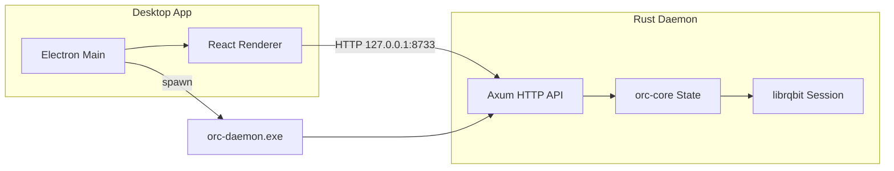

# Orc Torrent Rust GUI — Codebase Overview

## High-Level Architecture

- **Desktop app** (Electron + React in `ui/desktop/`) spawns and talks to the **daemon** over HTTP.
- **Daemon** (`crates/orc-daemon/`) exposes a REST API; business logic and BitTorrent runtime live in **orc-core** and **librqbit-patched**.

---

## Workspace Layout

| Area | Path | Role |
|------|------|------|
| **Workspace root** | [crates/Cargo.toml](crates/Cargo.toml) | Defines members: `orc-core`, `orc-daemon`. Patches `librqbit` with local `librqbit-patched`. |
| **orc-core** | [crates/orc-core/](crates/orc-core/) | Shared types, `OrcState` (torrents, policy, kill switch), VPN detection, GeoIP, and all daemon-side logic that uses librqbit. |
| **orc-daemon** | [crates/orc-daemon/](crates/orc-daemon/) | Axum server: routing, validation, sanitization, admin token, CORS, security headers. |
| **librqbit-patched** | [crates/librqbit-patched/](crates/librqbit-patched/) | Fork of rqbit 8.1.1; re-exports `PeerStatsFilter` so orc-core can call `api_peer_stats` and expose real peer data. Contains Rust BitTorrent engine + optional webui (React/Vite). |
| **Desktop UI** | [ui/desktop/](ui/desktop/) | Electron main process (daemon lifecycle, splash, notifications, installer), React renderer (torrent list, inspector, network/posture, settings). |

---

## Data Flow (Daemon to GUI)

1. **Electron main** (`ui/desktop/src/main/main.ts`): Ensures daemon is running (start if needed), health checks, restarts with backoff. Renderer loads after daemon is healthy.
2. **Renderer API layer** (`ui/desktop/src/renderer/utils/api.ts`): All calls go to `http://127.0.0.1:8733` with retries, timeouts, and request deduplication.
3. **Daemon routes** (`crates/orc-daemon/src/main.rs`): REST endpoints for torrents (list, add, get, status, content, start/stop, remove, recheck, announce, file priority, profile), peers, trackers, row snapshot, policy, kill switch, health, version, wallet, overlay, VPN status, admin shutdown.
4. **orc-core** (`crates/orc-core/src/lib.rs`): Holds `OrcState` (torrent map, policy, kill switch, GeoIP). A 1s `tick()` loop (spawned in daemon) updates stats from librqbit, enforces kill switch, and maintains heartbeat samples. Peer list uses `librqbit::api::PeerStatsFilter` from the patched crate.

---

## Key Technical Details

- **Config**: Daemon reads platform-specific config (e.g. Windows `%APPDATA%\OrcTorrent\config.json`) for listen port; see [crates/orc-daemon/src/config.rs](crates/orc-daemon/src/config.rs). Default bind is `127.0.0.1:8733`; non-loopback requires `DAEMON_ADMIN_TOKEN`.
- **Security**: Request validation (torrent ID format, JSON body limits), error sanitization (no paths/tokens in responses), constant-time admin token check, Content-Type enforcement, body size limit (10 MiB), concurrency limit (100).
- **VPN / kill switch**: orc-core detects VPN via interface name patterns (e.g. tun*, wg*, provider names); `tick()` engages kill switch when VPN drops and pauses all torrents; start/recheck/announce are blocked when kill switch is engaged.
- **Add torrent**: Magnet or base64 `.torrent`; duplicate info-hash reuses existing torrent (and optionally starts it). Save path from request or default `download_dir/hash`; librqbit add uses `overwrite: true` for resume.

---

## Desktop UI Structure (Renderer)

- **Entry**: `ui/desktop/src/renderer/main.tsx` → `ui/desktop/src/renderer/ui/App.tsx` and layout (AppShell, MainLayout, NavigationRail).
- **Features**: Torrent list/table, bulk actions, inspector (overview, files, peers, swarm, trackers, pieces, transfers, events), add-torrent (drag-drop, file picker), network/posture (VPN, kill switch, bind interface, threat presets), security/notification settings, log viewer, boot gate until daemon is ready.

---

## Build and Release

- **Rust**: `cargo build --release -p orc-daemon` (builds orc-core and links librqbit-patched). Daemon binary is copied into `ui/desktop/assets/bin/` for packaging.
- **Desktop**: `ui/desktop` — `npm run build` (Vite + tsc for main/preload/renderer), `npm run dist` for full Electron build + NSIS/zip (see [ui/desktop/package.json](ui/desktop/package.json)).
- **CI**: [.github/workflows/build-release.yml](.github/workflows/build-release.yml) — on `workflow_dispatch` or tag `v*`, builds on Windows, produces installer + zip, uploads artifacts; on tag, creates a GitHub Release with those assets.

---

## Summary

- **Single executable backend**: orc-daemon (Axum + orc-core + librqbit-patched) serves the REST API and runs the BitTorrent session.
- **Desktop**: Electron app that manages daemon process and provides a React UI talking to that API.
- **librqbit-patched** is required so orc-core can use `PeerStatsFilter` and `api_peer_stats` for the peers API; the rest of the stack is standard Rust/TS/React.
