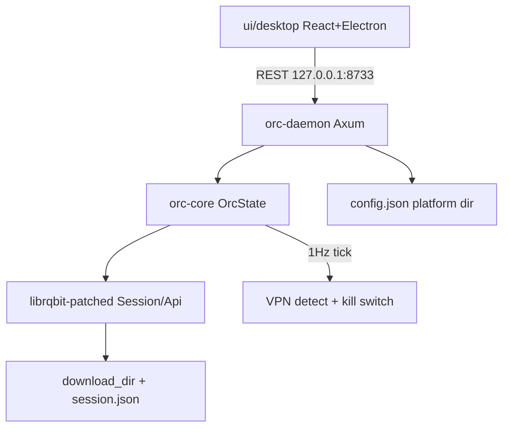

# Orc-Torrent Codebase Overview

This document maps the Orc-Torrent architecture for contributors implementing daily-driver features.

## High-level architecture

```mermaid
flowchart TB
    ElectronUI["ui/desktop React+Electron"] -->|REST 127.0.0.1:8733| Daemon["orc-daemon Axum"]
    Daemon --> Core["orc-core OrcState"]
    Core --> Rqbit["librqbit-patched Session/Api"]
    Rqbit --> Disk["download_dir + session.json"]
    Daemon --> Config["config.json platform dir"]
    Core -->|1Hz tick| VPN["VPN detect + kill switch"]
```

## Components

| Layer | Location | Responsibility |
|-------|----------|----------------|
| Desktop app | `ui/desktop/` | Electron main process manages daemon lifecycle; React renderer talks to daemon over HTTP |
| Daemon API | `crates/orc-daemon/src/main.rs` | Axum REST API (~40 routes), auth, torrent lifecycle glue |
| Config | `crates/orc-daemon/src/config.rs` | Persistent `config.json` (listen port, kill switch, policy, search, watch folders, seeding, bandwidth, net posture) |
| Core state | `crates/orc-core/src/lib.rs` | `OrcState`, `tick()`, VPN, policy, torrent records, seeding/bandwidth/privacy logic |
| BitTorrent engine | `crates/librqbit-patched/` | Patched rqbit 8.1.1; session, rate limits, peer stats |
| API client | `ui/desktop/src/renderer/utils/api.ts` | `getJson` / `postJson` / `patchJson` to daemon |

## Daemon API (key routes)

### System
- `GET /health`, `GET /version`

### Network / privacy
- `GET/PATCH /net/posture`, `GET /net/vpn-status`
- `GET/PATCH /net/kill-switch`, `POST /net/kill-switch/test`
- `GET /net/privacy-status`, `POST /net/privacy/preset/vpn-safety`
- `GET/PATCH /v1/policy`

### Torrents
- `GET/POST /torrents`, `GET /torrents/:id`, `GET /torrents/:id/status`
- `POST /torrents/:id/start|stop|remove|recheck|announce`
- `GET/PATCH /torrents/limits`, `PATCH /bandwidth/schedule`

### Automation
- `GET/PATCH /watch-folders`, `POST /watch-folders/test`, `GET /watch-folders/events`
- `GET/PATCH /seeding`, `GET/PATCH /torrents/:id/seeding`

## Config persistence

Platform-specific path:
- **macOS:** `~/Library/Application Support/OrcTorrent/config.json`
- **Linux:** `~/.config/OrcTorrent/config.json`
- **Windows:** `%APPDATA%\OrcTorrent\config.json`

Torrent session data is stored separately by rqbit at `{ORC_DOWNLOAD_DIR}/session.json`.

## State model

- **OrcState** holds in-memory torrent records (UUID ids), policy, kill switch runtime, bind interface, bandwidth profile, and rqbit API handle.
- **tick()** runs at 1 Hz: syncs rqbit stats, enforces kill switch, seeding limits, and bandwidth schedule.
- **TorrentRecord** pairs `Torrent` metadata with `TorrentRuntime` (rates, bytes, state, seeding timestamps).

## Frontend structure

- **App.tsx** — central state, page routing (`torrents`, `settings`, `search`, `events`), polling
- **Settings tabs** — general, downloads, watch, seeding, bandwidth, search, privacy, network, interface, advanced
- **TorrentInspector** — torrent detail panel (overview, files, peers, trackers, etc.)
- **PrivacyStatusCard** — consolidated VPN/privacy status on main dashboard

## Security model

- Default bind: `127.0.0.1:8733` (loopback only)
- Non-loopback binds require `DAEMON_ADMIN_TOKEN` and `x-admin-token` header for mutations
- Config file written with mode `0600` on Unix
- Path validation on torrent save paths and watch folder paths

## Not implemented (v2.3 scope)

The following are **out of scope** and not shipped as working features:

- Overlay or anonymous routing (policy flags may exist; no overlay transport)
- I2P, WebTorrent, or Tor transport
- Plugin system or wallet integration
- Built-in piracy indexers (premium search uses approved providers only)

## Known limitations

See [KNOWN_LIMITATIONS.md](KNOWN_LIMITATIONS.md).
